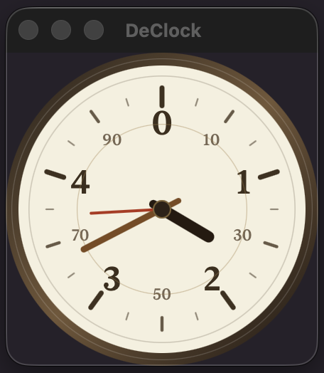

# DeClock

DeClock is a SwiftUI analog clock app for Apple platforms.

A useless clock with 10 hours in a day, 100 minutes in an hour, and 100 seconds in a minute.

The macOS app uses a transparent, resizable clock window and includes a Settings toggle for launching DeClock at login.

## Screenshot



## Requirements

- Xcode 26.4.1 or later
- macOS 26.4 SDK or later

## Build

```sh
xcodebuild -project declock.xcodeproj -scheme declock -configuration Release -destination 'generic/platform=macOS' build
```

## Create a macOS Package

```sh
xcodebuild -project declock.xcodeproj -scheme declock -configuration Release -destination 'generic/platform=macOS' -derivedDataPath /tmp/declock-derived build
mkdir -p /tmp/declock-pkg-root-0.6.1/Applications
ditto --norsrc /tmp/declock-derived/Build/Products/Release/declock.app /tmp/declock-pkg-root-0.6.1/Applications/declock.app
codesign --force --deep --sign - /tmp/declock-pkg-root-0.6.1/Applications/declock.app
COPYFILE_DISABLE=1 pkgbuild --root /tmp/declock-pkg-root-0.6.1 --identifier org.spumoni.declock --version 0.6.1 artifacts/declock-0.6.1.pkg
```

## Developer ID Signing

Install both Apple Developer certificates before creating a signed package:

- `Developer ID Application` signs `declock.app`.
- `Developer ID Installer` signs `declock-0.6.1.pkg`.

```sh
codesign --force --deep --options runtime --timestamp --sign "Developer ID Application: Your Name (TEAMID)" /tmp/declock-pkg-root-0.6.1/Applications/declock.app
pkgbuild --root /tmp/declock-pkg-root-0.6.1 --identifier org.spumoni.declock --version 0.6.1 --sign "Developer ID Installer: Your Name (TEAMID)" artifacts/declock-0.6.1.pkg
```
